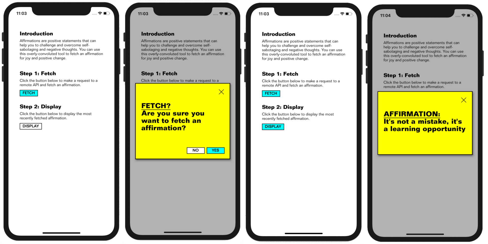

# React Native coding challenge

We are looking for people who can build great software, so we created this challenge to test your skills.

## Brief

Build a robust modal component and present its features according to the screenshots below:

## Additional information

> **This is important.** We hope you can spend about 4 hours on this project. If you can finish faster - great! If not, limit yourself and don't spend much longer than 4 hours.

### Requirements
- Do not use any external dependencies to build the modal itself - we want to see how you go about it and build it from scratch!
- Use a remote RESTful API to fetch the affirmations (or other words of wisdom). You can use a very simple API available [here](https://www.affirmations.dev/).
- The modal will be used on many screens throughout the app. We are looking for DRY solutions.

### Stretch goals
- Show a loading indicator during network requests.
- Keep `DISPLAY` button disabled if there is no affirmation ready to be shown.

### Some tips
- We've provided a lot of code for you to get up and running fast! We encourage you to use it if you think it will help, but feel free to roll your own solution if you like.
- The UI does not have to be pixel-perfect.
- We value quality over feature-completeness. The goal of this code sample is to help us identify what you consider production-ready code. You should consider this code ready for final review with your colleague, i.e. this would be the last step before deploying to production.

## How to submit
Privately fork this repository on GitHub and invite [rafalzawadzki](https://github.com/rafalzawadzki) to it.

